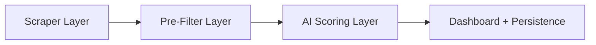
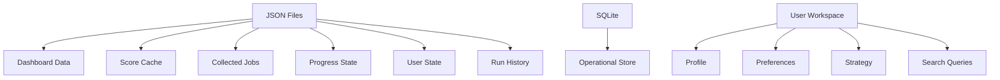

# Job Scout — Project State Report

> **Purpose**: Comprehensive reverse-engineering audit of the entire Job Scout codebase, built from scratch by reading every file. This document is the foundational context for continuing development in Antigravity.

---

## 1. Comprehensive Feature Map

### 1.1 Core Pipeline

The application is a **LinkedIn-first automated job discovery and scoring system** with a three-stage pipeline:



| Stage | Responsibility | Key Files |
|-------|---------------|-----------|
| **Scraper** | Browser-automated job card extraction from LinkedIn, Indeed, Glassdoor | [linkedin.py](file:///c:/Users/oabd3/Desktop/VibeCoding-Projects/job_agent/scrapers/linkedin.py) (98KB), [indeed.py](file:///c:/Users/oabd3/Desktop/VibeCoding-Projects/job_agent/scrapers/indeed.py), [glassdoor.py](file:///c:/Users/oabd3/Desktop/VibeCoding-Projects/job_agent/scrapers/glassdoor.py) |
| **Pre-Filter** | Dutch language, location, internship, entry-level, employment type, company-application-limit checks | [job_scout.py](file:///c:/Users/oabd3/Desktop/VibeCoding-Projects/job_agent/agent/job_scout.py) (5426 lines) |
| **AI Scoring** | Multi-provider structured-output scoring with retry/fallback chains | [brain.py](file:///c:/Users/oabd3/Desktop/VibeCoding-Projects/job_agent/agent/brain.py) (4659 lines) |
| **Dashboard** | Live HTML dashboard with server-side persistence API | [serve_dashboard.py](file:///c:/Users/oabd3/Desktop/VibeCoding-Projects/job_agent/serve_dashboard.py), [recommended_jobs_dashboard.html](file:///c:/Users/oabd3/Desktop/VibeCoding-Projects/job_agent/recommended_jobs_dashboard.html) |

### 1.2 AI Backend Support (Multi-Provider)

The brain supports **7 scoring backends** with automatic failover:

| Backend | Config Key | Status |
|---------|-----------|--------|
| Claude (Anthropic) | `AI_BACKEND=claude` | Primary historical provider |
| Gemini (Google) | `AI_BACKEND=gemini`, `GEMINI_API_KEY` | Fully integrated with thinking budget support |
| Cerebras | `AI_BACKEND=cerebras`, `CEREBRAS_API_KEY` | OpenAI-compatible endpoint |
| Ollama Cloud | `AI_BACKEND=ollama_cloud`, `OLLAMA_API_KEY` | Custom Ollama chat protocol |
| LM Studio (Local) | `AI_BACKEND=lmstudio` | Local inference with reasoning capability detection |
| OpenAI-Compatible | `AI_BACKEND=openai_compatible` | Generic endpoint |
| **Auto** | `AI_BACKEND=auto` | **Waterfall failover** through all configured providers with per-backend cooldowns |

### 1.3 Search Scope System

A versioned, multi-market search scope system supports:

- **6 geographic markets**: Netherlands (stable), Germany (beta), UAE (experimental), Saudi Arabia/Qatar/Kuwait (disabled)
- **Employment preferences**: full-time-preferred, full-time-only, part-time-only, full-or-part-time, any
- **LinkedIn-native radius mapping**: 0/8/16/40/80/160 km → miles conversion
- **Built-in missions**: `local-career-hunt`, `nearby-income-search`, `germany-english-career`, `gulf-sponsored-career`
- **Sponsorship/relocation/housing/health insurance metadata** per market

### 1.4 Search Query Plan System

Structured query planning with career-lane awareness:

- **Three career lanes**: Primary (creative/UX/product), Bridge (data/ops/consulting), Fallback (income/support)
- **Phase ordering**: initial_coverage → remaining → exploration
- **Query learning**: Historical performance-based reordering of queries per search scope
- **AI budget guards**: Smart/Deep/Off modes with quality checkpoints (40/80/120 call thresholds)

### 1.5 Fresh Scout Mode

A sophisticated "smart fresh" system that dynamically manages scraping depth:

- **Duplicate detection**: Known-ratio tracking per page, duplicate-heavy streak counting
- **Quality targets**: Configurable Apply First / Good-or-Better job targets
- **AI budget management**: Three-tier guard system (quality check → strict check → soft cap)
- **Early stopping**: Automatic stop when quality targets met or budget exhausted
- **Page quality tracking**: Per-page metrics (cards seen, valid/known/new jobs, known ratio)

### 1.6 Dashboard Application

A full **single-page application** with 9 pages:

| Page | Purpose |
|------|---------|
| **Home** | Daily starting point with actionable job count, setup health, and run status |
| **Jobs** | Kanban board (Apply First / Good Options / Low Probability / Rejected) with career-lane tabs, 14+ filters, board/list layout toggle |
| **Scout** | Configure, start, stop, resume runs without terminal commands |
| **Profile & CV** | Edit personal info, experience, education, skills, languages, work preferences; upload CV |
| **Job Strategy** | Career direction, blocking rules, scoring thresholds, search queries by lane, fresh scout behavior |
| **Applications** | Track application status, interviews, offers |
| **Assistant** | Application assistant (cover letters, Q&A) |
| **Runs & Logs** | Run history and terminal log viewer |
| **Settings** | AI backend configuration, board settings |

### 1.7 Server-Side Services

The dashboard server ([serve_dashboard.py](file:///c:/Users/oabd3/Desktop/VibeCoding-Projects/job_agent/serve_dashboard.py), 1318 lines) provides a full REST API:

| Service | Module | Endpoints |
|---------|--------|-----------|
| Profile management | [profile_service.py](file:///c:/Users/oabd3/Desktop/VibeCoding-Projects/job_agent/agent/profile_service.py) | GET/POST `/api/profile`, CV upload/download |
| Strategy management | [strategy_service.py](file:///c:/Users/oabd3/Desktop/VibeCoding-Projects/job_agent/agent/strategy_service.py) | GET/POST `/api/strategy` |
| AI settings | [ai_settings_service.py](file:///c:/Users/oabd3/Desktop/VibeCoding-Projects/job_agent/agent/ai_settings_service.py) | GET/POST `/api/settings/ai` |
| Board settings | [board_settings_service.py](file:///c:/Users/oabd3/Desktop/VibeCoding-Projects/job_agent/agent/board_settings_service.py) | GET/POST `/api/settings/boards` |
| Run controller | `DashboardRunController` class | Start/stop/resume scout processes |
| User state | [dashboard_user_state.py](file:///c:/Users/oabd3/Desktop/VibeCoding-Projects/job_agent/agent/dashboard_user_state.py) | Job tracking status, bulk operations |
| Maintenance | [maintenance_service.py](file:///c:/Users/oabd3/Desktop/VibeCoding-Projects/job_agent/agent/maintenance_service.py) | Cache cleanup, data repair |
| Legacy tools | [legacy_tools_service.py](file:///c:/Users/oabd3/Desktop/VibeCoding-Projects/job_agent/agent/legacy_tools_service.py) | Read-only application statistics |
| Application assistant | [application_assistant_service.py](file:///c:/Users/oabd3/Desktop/VibeCoding-Projects/job_agent/agent/application_assistant_service.py) | Cover letter and Q&A generation |

### 1.8 Automated Application System

A separate, older subsystem ([job_agent.py](file:///c:/Users/oabd3/Desktop/VibeCoding-Projects/job_agent/agent/job_agent.py), 602 lines) handles actual job applications:

- LinkedIn Easy Apply modal-only flow with step-by-step control
- Claude-guided form-filling loop (screenshot → decide → execute action → loop)
- Cover letter generation
- Assessment detection and skip logic
- Learned answers system for screening questions
- Human-in-the-loop pause before final submit
- Multi-board support (LinkedIn, Indeed, Glassdoor)

### 1.9 Persistence Architecture



| File | Size | Purpose |
|------|------|---------|
| `recommended_jobs_dashboard_data.json` | **10.2 MB** | Live dashboard state with all runs and jobs |
| `scout_collected_jobs.json` | **16.7 MB** | Persistent collected job descriptions |
| `scored_jobs_cache.json` | **3.9 MB** | AI scoring result cache |
| `scout_run_history.json` | 574 KB | Historical run summaries |
| `high_success_probability_jobs_multi.json` | 134 KB | Latest merged multi-query output |
| `scout_progress.json` | 35 KB | Resumable run progress |
| `recommended_jobs_dashboard_user_state.json` | 203 KB | User review state (applied, irrelevant, notes) |
| `job_scout.db` (SQLite) | — | Operational store for incremental indexing |

### 1.10 Data Safety System

All file I/O goes through [safe_file_io.py](file:///c:/Users/oabd3/Desktop/VibeCoding-Projects/job_agent/agent/safe_file_io.py):

- Atomic writes via temp file + rename
- Retry with exponential backoff on write failures
- JSON recovery (handles BOM, truncation, encoding issues)
- `PersistenceError` exception hierarchy for graceful degradation

---

## 2. Architecture & Data Flow

### 2.1 Entry Points

| Entry Point | Script | Purpose |
|-------------|--------|---------|
| Dashboard server | `python serve_dashboard.py` | Primary user interface (HTTP server at `127.0.0.1:8000`) |
| Multi-query scout | `python scout_jobs_multi.py` | CLI or dashboard-spawned multi-query scouting |
| Single-query scout | `python scout_jobs.py` | Legacy single-query scouting |
| Job applicator | `python main.py` | Automated job application loop |
| Job status tracker | `python track_job_status.py` | Application status tracking |
| Dashboard launcher | `start_dashboard.ps1` | PowerShell convenience launcher |

### 2.2 Dashboard-First Architecture

The dashboard is the **primary controller**. When a user clicks "Run Scout":

1. `DashboardRunController.start_workflow()` validates parameters against whitelists
2. Spawns `scout_jobs_multi.py` as a **subprocess** with `DASHBOARD_STARTED_SCOUT=1`
3. The scout process writes to `recommended_jobs_dashboard_data.json` via `LiveRecommendedJobsDashboard`
4. The dashboard polls the JSON file for live progress updates
5. The dashboard can send stop signals via [scout_stop.py](file:///c:/Users/oabd3/Desktop/VibeCoding-Projects/job_agent/agent/scout_stop.py) (file-based signal mechanism)

### 2.3 Job Processing Pipeline (Detailed)

```
1. Build search URL with scope parameters
2. Navigate browser to LinkedIn search
3. Scroll and extract job cards (title, company, location, URL)
4. For each card:
   a. Check if URL is valid (canonical LinkedIn job URL)
   b. Check if job is globally known (score cache, collected jobs, operational store)
   c. If known → skip at card stage (no browser open)
   d. If unknown → open job page, extract full description
   e. Pre-filter: Dutch language, location, internship, seniority, excluded keywords
   f. If rejected → record terminal analysis, emit live dashboard event
   g. If survived → AI scoring request
   h. AI result: score 0-100, career lane, employment types, sponsorship, market concerns
   i. Classify: APPLY_FIRST (≥70), GOOD_OPTIONS (≥50), LOW_PROBABILITY (<50), REJECTED
   j. Record to live dashboard, score cache, collected jobs
5. Build per-query report
6. Merge all query reports (cross-query deduplication)
7. Write final output files
8. Complete live dashboard run
```

### 2.4 User Workspace Model

[user_workspace.py](file:///c:/Users/oabd3/Desktop/VibeCoding-Projects/job_agent/agent/user_workspace.py) maintains a private workspace at `data/user_workspace/`:

- Seeds from `config/profile.json` and `config/preferences.json` on first run
- Migrates CV files to `data/user_workspace/cv/`
- Auto-generates `search_query_groups.json` from flat `search_queries.txt`
- Creates timestamped backups before each save
- Schema-versioned manifest (`job_agent_workspace.v1`)

---

## 3. File Inventory

### 3.1 Agent Modules (36 files in `agent/`)

| File | Lines | Bytes | Purpose |
|------|-------|-------|---------|
| [brain.py](file:///c:/Users/oabd3/Desktop/VibeCoding-Projects/job_agent/agent/brain.py) | 4,659 | 185K | Multi-provider AI scoring engine with structured output |
| [job_scout.py](file:///c:/Users/oabd3/Desktop/VibeCoding-Projects/job_agent/agent/job_scout.py) | 5,426 | 227K | LinkedIn job scout: scraping, filtering, AI scoring orchestration |
| [live_recommended_jobs_dashboard.py](file:///c:/Users/oabd3/Desktop/VibeCoding-Projects/job_agent/agent/live_recommended_jobs_dashboard.py) | 1,143 | 48K | Live dashboard JSON writer with migrations |
| [operational_store.py](file:///c:/Users/oabd3/Desktop/VibeCoding-Projects/job_agent/agent/operational_store.py) | — | 30K | SQLite-based incremental job index |
| [job_agent.py](file:///c:/Users/oabd3/Desktop/VibeCoding-Projects/job_agent/agent/job_agent.py) | 602 | 25K | Automated application loop (Easy Apply + Claude fill) |
| [scout_console_reporter.py](file:///c:/Users/oabd3/Desktop/VibeCoding-Projects/job_agent/agent/scout_console_reporter.py) | — | 23K | Rich terminal progress reporting |
| [job_scope_metadata.py](file:///c:/Users/oabd3/Desktop/VibeCoding-Projects/job_agent/agent/job_scope_metadata.py) | — | 23K | Career lane classification, scope enrichment |
| [ai_settings_service.py](file:///c:/Users/oabd3/Desktop/VibeCoding-Projects/job_agent/agent/ai_settings_service.py) | — | 19K | AI backend configuration API |
| [maintenance_service.py](file:///c:/Users/oabd3/Desktop/VibeCoding-Projects/job_agent/agent/maintenance_service.py) | — | 19K | Data repair and cache maintenance |
| [indeed_job_scout.py](file:///c:/Users/oabd3/Desktop/VibeCoding-Projects/job_agent/agent/indeed_job_scout.py) | — | 19K | Indeed-specific scout (description extraction only) |
| [browser.py](file:///c:/Users/oabd3/Desktop/VibeCoding-Projects/job_agent/agent/browser.py) | — | 17K | Playwright browser wrapper with human-like delays |
| [dashboard_user_state.py](file:///c:/Users/oabd3/Desktop/VibeCoding-Projects/job_agent/agent/dashboard_user_state.py) | — | 14K | User review state management |
| [search_scope.py](file:///c:/Users/oabd3/Desktop/VibeCoding-Projects/job_agent/agent/search_scope.py) | 399 | 13K | Multi-market search scope configuration |
| [board_settings_service.py](file:///c:/Users/oabd3/Desktop/VibeCoding-Projects/job_agent/agent/board_settings_service.py) | — | 12K | Job board settings API |
| [query_learning.py](file:///c:/Users/oabd3/Desktop/VibeCoding-Projects/job_agent/agent/query_learning.py) | — | 12K | Query performance learning and reordering |
| [scout_collected_jobs.py](file:///c:/Users/oabd3/Desktop/VibeCoding-Projects/job_agent/agent/scout_collected_jobs.py) | — | 12K | Persistent collected job description store |
| [fresh_scout_policy.py](file:///c:/Users/oabd3/Desktop/VibeCoding-Projects/job_agent/agent/fresh_scout_policy.py) | 263 | 11K | Fresh Scout configurable policy dataclass |
| [safe_file_io.py](file:///c:/Users/oabd3/Desktop/VibeCoding-Projects/job_agent/agent/safe_file_io.py) | — | 10K | Atomic writes, retry, JSON recovery |
| [search_query_plan.py](file:///c:/Users/oabd3/Desktop/VibeCoding-Projects/job_agent/agent/search_query_plan.py) | — | 10K | Structured query planning with career lanes |
| [user_workspace.py](file:///c:/Users/oabd3/Desktop/VibeCoding-Projects/job_agent/agent/user_workspace.py) | 256 | 10K | Private user workspace management |
| [application_assistant_service.py](file:///c:/Users/oabd3/Desktop/VibeCoding-Projects/job_agent/agent/application_assistant_service.py) | — | 9K | Cover letter & Q&A API |
| [strategy_service.py](file:///c:/Users/oabd3/Desktop/VibeCoding-Projects/job_agent/agent/strategy_service.py) | — | 9K | Job strategy persistence API |
| [profile_service.py](file:///c:/Users/oabd3/Desktop/VibeCoding-Projects/job_agent/agent/profile_service.py) | — | 7K | Profile management API |
| [scout_review_latest.py](file:///c:/Users/oabd3/Desktop/VibeCoding-Projects/job_agent/agent/scout_review_latest.py) | — | 6K | Review-latest JSON writer |
| [debug_linkedin_easy_apply.py](file:///c:/Users/oabd3/Desktop/VibeCoding-Projects/job_agent/debug_linkedin_easy_apply.py) | — | 6K | Debug helper for Easy Apply flow |
| [legacy_tools_service.py](file:///c:/Users/oabd3/Desktop/VibeCoding-Projects/job_agent/agent/legacy_tools_service.py) | — | 6K | Read-only legacy application stats |
| [job_tracking.py](file:///c:/Users/oabd3/Desktop/VibeCoding-Projects/job_agent/agent/job_tracking.py) | — | 6K | Job deduplication and URL canonicalization |
| [tracker.py](file:///c:/Users/oabd3/Desktop/VibeCoding-Projects/job_agent/agent/tracker.py) | — | 5K | Application tracker (legacy SQLite) |
| [process_identity.py](file:///c:/Users/oabd3/Desktop/VibeCoding-Projects/job_agent/agent/process_identity.py) | — | 5K | Scout process inspection/termination |
| [scout_run_logger.py](file:///c:/Users/oabd3/Desktop/VibeCoding-Projects/job_agent/agent/scout_run_logger.py) | — | 3K | Terminal output logging to file |
| [scout_stop.py](file:///c:/Users/oabd3/Desktop/VibeCoding-Projects/job_agent/agent/scout_stop.py) | — | 2K | File-based stop signal mechanism |
| [scout_run_history.py](file:///c:/Users/oabd3/Desktop/VibeCoding-Projects/job_agent/agent/scout_run_history.py) | — | 2K | Run history append-only log |
| [job_metadata.py](file:///c:/Users/oabd3/Desktop/VibeCoding-Projects/job_agent/agent/job_metadata.py) | — | 2K | Apply method normalization |
| [scout_cli_modes.py](file:///c:/Users/oabd3/Desktop/VibeCoding-Projects/job_agent/agent/scout_cli_modes.py) | — | 2K | CLI board mode resolution |
| [description_log.py](file:///c:/Users/oabd3/Desktop/VibeCoding-Projects/job_agent/agent/description_log.py) | — | 2K | Description-only extraction log |
| [scout_progress.py](file:///c:/Users/oabd3/Desktop/VibeCoding-Projects/job_agent/agent/scout_progress.py) | — | 1K | Progress JSON store wrapper |

### 3.2 Dashboard Frontend

| File | Bytes | Purpose |
|------|-------|---------|
| [app.js](file:///c:/Users/oabd3/Desktop/VibeCoding-Projects/job_agent/dashboard/app.js) | **227K** | Main dashboard application logic |
| [styles.css](file:///c:/Users/oabd3/Desktop/VibeCoding-Projects/job_agent/dashboard/styles.css) | **66K** | Complete CSS design system (dark/light themes) |
| `modules/core.js` | 1.2K | Core utilities |
| `modules/jobs.js` | 3K | Job rendering and interactions |
| `modules/scout.js` | 2.2K | Scout page logic |
| `modules/profile.js` | 0.8K | Profile page |
| `modules/applications.js` | 0.6K | Applications page |
| `modules/settings.js` | 0.4K | Settings page |
| `modules/navigation.js` | 0.5K | App navigation |
| `modules/maintenance.js` | 0.9K | Maintenance tools |
| `modules/list-editor.js` | 0.8K | List editor component |

### 3.3 Tests (30 files)

The test suite is extensive and covers nearly every module:

- Dashboard: `test_live_dashboard_writer.py`, `test_live_dashboard_html.py`, `test_live_dashboard_scout_events.py`, `test_dashboard_run_controller.py`, `test_dashboard_user_state.py`
- AI: `test_gemini_backend.py`, `test_hosted_ai_backends.py`
- Scout: `test_fresh_scout_policy.py`, `test_fresh_scout_global_stop.py`, `test_multi_query_finalization.py`
- Config: `test_search_scope.py`, `test_search_query_plan.py`, `test_query_learning.py`
- Services: `test_ai_settings_service.py`, `test_board_settings_service.py`, `test_profile_service.py`, `test_strategy_service.py`, `test_maintenance_service.py`
- Infrastructure: `test_safe_file_io.py`, `test_operational_store.py`, `test_user_workspace.py`, `test_process_identity.py`

---

## 4. The Cliffhanger — Where the Previous Agent Left Off

### 4.1 Last Known Work Area

Based on the code's maturity state, the previous agent was most recently working on:

> [!IMPORTANT]
> **The application is in a production-usable state for job scouting.** The dashboard, scoring engine, and multi-query orchestrator are feature-complete and heavily polished. The last phase of work focused on the **dashboard workspace expansion** — adding the Strategy, Profile, Settings, Scout, Applications, and Assistant pages to what was originally just a Jobs board.

**Evidence of recent work:**
1. The dashboard HTML includes **9 fully-built pages** with extensive form editors, modals, and workspace-level features
2. The CSS has a versioned cache-buster: `styles.css?v=20260613-strategy-search-modes-3` — dated June 13, 2026
3. The `search_scope.py` module has a full multi-market system with Germany (beta) and Gulf markets (experimental/disabled) — this is forward-looking architecture
4. The `DashboardRunController` has a complete **Run Scout modal** workflow with market selection, employment preferences, AI budget mode, and search goal configuration
5. Multiple **migration systems** exist in the live dashboard writer (career lane backfill, scope metadata backfill)

### 4.2 The Exact Interruption Point

The previous agent appears to have been in the middle of or just completed:

1. **Search Scope Integration** — The `build_search_scope()` system was recently wired into both the CLI and dashboard run controller
2. **Career Lane Enrichment** — The `job_scope_metadata.py` module (23KB) enriches each job with market-specific metadata (sponsorship, relocation, housing, health insurance)
3. **Dashboard Run Controller Enhancements** — The controller supports full market/radius/employment/search-goal configuration from the UI

### 4.3 State of the "Apply" Pipeline

> [!WARNING]
> The automated application system ([job_agent.py](file:///c:/Users/oabd3/Desktop/VibeCoding-Projects/job_agent/agent/job_agent.py)) exists and is **structurally complete** but appears to be **intentionally kept separate** from the dashboard. The dashboard explicitly labels it under "Advanced Tools" and notes: *"Automatic application submission and unaudited Glassdoor execution stay unavailable."*

---

## 5. Unfinished Business

### 5.1 Explicitly Stubbed / Not Implemented

| Location | What | Evidence |
|----------|------|----------|
| [job_agent.py:176-179](file:///c:/Users/oabd3/Desktop/VibeCoding-Projects/job_agent/agent/job_agent.py#L176-L179) | **standalone_sites** scraper | `"standalone_sites is enabled in config but is not implemented yet."` |
| [job_agent.py:217-219](file:///c:/Users/oabd3/Desktop/VibeCoding-Projects/job_agent/agent/job_agent.py#L217-L219) | **standalone_sites** in `_collect_jobs` | Same warning repeated |
| [search_scope.py:109-144](file:///c:/Users/oabd3/Desktop/VibeCoding-Projects/job_agent/agent/search_scope.py#L109-L144) | **Saudi Arabia, Qatar, Kuwait markets** | `"availability": "disabled"` — market profiles exist but are disabled |
| Indeed platform | **Indeed AI scoring** | `"description_extraction_only": True` in `PLATFORM_CAPABILITIES` — Indeed only extracts descriptions, no AI scoring |
| Glassdoor | **Glassdoor full pipeline** | Dashboard notes Glassdoor execution is "unaudited" and unavailable |
| Dashboard HTML | **Applications page** | The page structure exists but the actual application tracking table and detail views are likely minimal (stub module is only 624 bytes) |
| Dashboard HTML | **Assistant page** | Application assistant service exists (9.5K) but the frontend module stub is minimal |

### 5.2 Known Limitations / Technical Debt

| Area | Issue |
|------|-------|
| **Browser dependency** | Hard dependency on Playwright with Chromium or Firefox profiles stored in `data/browser_profile` — requires manual LinkedIn login |
| **Single-threaded AI** | All AI scoring calls are synchronous (blocking `urlopen` or library calls). No async HTTP for provider requests. |
| **JSON file scaling** | The `recommended_jobs_dashboard_data.json` is already **10.2 MB** and `scout_collected_jobs.json` is **16.7 MB**. No archival or rotation system exists. |
| **Score cache size** | `scored_jobs_cache.json` at 3.9 MB — loaded entirely into memory for each scoring run |
| **Dashboard polling** | Dashboard reads the entire 10 MB JSON file on each refresh/poll cycle |
| **No authentication** | Dashboard server binds to `127.0.0.1` only (local security) but has no user authentication |
| **Cover letter generation** | Uses `brain.generate_cover_letter()` but this appears to only work with the Claude backend |

### 5.3 Fragile Areas

| Area | Risk |
|------|------|
| **LinkedIn selector stability** | The 98KB LinkedIn scraper contains highly specific CSS selectors (`.job-card-container`, `.scaffold-layout__list-item`) that break when LinkedIn updates their DOM |
| **Process management** | `DashboardRunController` spawns scout as subprocess and tracks via PID file — no process supervisor, no crash recovery beyond file-based progress |
| **Concurrent writes** | Multiple processes (dashboard server + scout subprocess) write to the same JSON files. Protected only by atomic writes, not file locks |
| **LM Studio dependency** | LM Studio integration queries `/api/v1/models` for reasoning capability detection — tightly coupled to LM Studio's private API |

### 5.4 Missing Error Handling

| Location | Gap |
|----------|-----|
| `brain.py` Gemini integration | Rate limit cooldowns use per-backend `time.monotonic()` tracking, but the cooldown state is not persisted — restarting the process clears all cooldowns |
| `scout_jobs_multi.py` finalization | If the merged output write fails, the live dashboard may show "completed" but the `high_success_probability_jobs_multi.json` file is missing |
| `serve_dashboard.py` service handlers | Most API endpoints catch `Exception` broadly and return HTTP 500 with error message — no structured error response format |

### 5.5 Configuration Completeness

| Config File | Status |
|-------------|--------|
| [.env](file:///c:/Users/oabd3/Desktop/VibeCoding-Projects/job_agent/.env) | ✅ Present (1.3 KB) — actual API keys configured |
| [.env.example](file:///c:/Users/oabd3/Desktop/VibeCoding-Projects/job_agent/.env.example) | ✅ Present (2.1 KB) — comprehensive template |
| [config/profile.json](file:///c:/Users/oabd3/Desktop/VibeCoding-Projects/job_agent/config/profile.json) | ✅ Present (15 KB) — fully populated with Omar's profile |
| [config/preferences.json](file:///c:/Users/oabd3/Desktop/VibeCoding-Projects/job_agent/config/preferences.json) | ✅ Present (7.9 KB) — detailed job board and scoring preferences |
| [PERFECT SUITABLE JOB PROFILE.txt](file:///c:/Users/oabd3/Desktop/VibeCoding-Projects/job_agent/PERFECT%20SUITABLE%20JOB%20PROFILE.txt) | ✅ Present (9.5 KB) — comprehensive recruiter-style scoring instructions |
| [search_queries.txt](file:///c:/Users/oabd3/Desktop/VibeCoding-Projects/job_agent/search_queries.txt) | ✅ Present (1 KB) — active query list |

---

## 6. Technology Stack Summary

| Layer | Technology |
|-------|-----------|
| Language | Python 3.10+ |
| Browser automation | Playwright (Chromium/Firefox) |
| AI Providers | Anthropic (Claude), Google GenAI (Gemini), Cerebras, Ollama, LM Studio, OpenAI-compatible |
| HTTP Server | `http.server.ThreadingHTTPServer` (stdlib) |
| Database | SQLite (via `sqlite3` stdlib) |
| Persistence | JSON (atomic writes) + SQLite |
| Frontend | Vanilla HTML/CSS/JS (no framework) |
| Terminal UI | Rich (Python) |
| Environment | python-dotenv |
| Dashboard CSS | Custom design system with CSS custom properties, dark/light themes |

---

## 7. Key Design Decisions to Preserve

1. **Dashboard-first**: The dashboard is the user's primary interface. CLI is secondary.
2. **No credential storage**: The app never stores LinkedIn/Indeed credentials. Manual login is required.
3. **Atomic persistence**: All JSON writes use temp-file-then-rename to prevent corruption.
4. **Multi-provider AI**: The scoring engine abstracts all providers behind a unified prompt/response interface.
5. **Career lane taxonomy**: Jobs are classified into primary/bridge/fallback/other lanes, which is deeply integrated into the UI, queries, scoring, and filtering.
6. **Fresh-mode intelligence**: The smart fresh system dynamically adjusts scraping behavior based on real-time quality metrics.
7. **Resumability**: Every multi-query run tracks progress at the query and page level, supporting resume after interruption.
